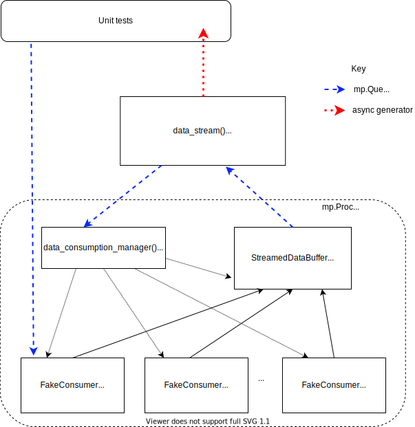

Data Streaming
==============

The data streaming interface provides access to data in the ESS data streaming system. The functionality
is included in ``scippneutron`` rather than the facility-specific ``ess`` library as
the same system is also used to varying extents at other neutron sources including ISIS
Pulsed Neutron and Muon Source, SINQ: The Swiss Spallation Neutron Source, and ANSTO:
Australian Centre for Neutron Scattering.

Apache Kafka
------------

The ESS data streaming system is based on the Apache Kafka data streaming platform. The
basic terminology used in the scippneutron codebase is described here, but the
introductory documentation at `<https://kafka.apache.org>`_ is well worth 5-10 minutes
of your time.

Apache Kafka is a publish-subscribe system for passing data over the network. A *producer* client
publishes data to a named data stream, a *topic*, on a Kafka server, a *broker*. Kafka brokers are
usually deployed as a cluster to increase the data throughput they can support and also provide
data and service redundancy in case a broker goes down due to failure or to be updated etc. *Consumer*
clients subscribe to data on one or more topics.

On the brokers messages received from producers are written to disk in one or more log files per
topic. These log files are called *partitions*. The position of each message in the partition is
called the *offset*. Messages older than a configurable time are deleted, so the first available
offset in each partition may not be 0. Consumers have control over what offset they read from, so
they can start consuming the stream from the oldest available message, the latest message, or at
from the next available message after a specified time.

Many libraries are available for the *Client API*; to implement producer and consumer applications. In
``scippneutron`` we use `confluent-kafka-python <https://github.com/confluentinc/confluent-kafka-python>`_
which is based on a high performance C implementation `librdkafka <https://github.com/edenhill/librdkafka>`_.

Note, messages published to Kafka are often called *events*, but this terminology is avoided in
``scippneutron`` as we usually use this term for "neutron detection events" specifically.

Terminology:

- *Topic* - a named data stream
- *Partition* - a log file, one or more per topic
- *Offset* - the position of a message in a partition
- *Broker* - Kafka server, usually deployed as a cluster
- *Consumer* - a client application which subscribes to data on Kafka
- *Producer* - a client application which publishes data to Kafka

FlatBuffers
-----------

Kafka does not dictate how data are serialized to be transmitted in a message over the network.
The ESS streaming system uses `FlatBuffers <https://google.github.io/flatbuffers/>`_ for serialization.
Data to be serialized with FlatBuffers are described by an IDL schema, the FlatBuffer compiler ``flatc``
can be used to generate code from the schema which provides a builder class with which to construct
the serialized buffer, as well as methods to extract data from the buffer.

Each type of data, for example neutron detection events, sample environment measurement,
experiment run start event, etc has an associated FlatBuffer schema. These are stored in a repository
`<https://github.com/ess-dmsc/streaming-data-types/>`_. The ESS has also developed a Python library
to provide a convenient "serialize" and "deserialize" method for each schema
`<https://github.com/ess-dmsc/python-streaming-data-types/>`_, this is available as a conda package
`<https://anaconda.org/ess-dmsc/ess-streaming-data-types>`_.

Each schema file defines a ``file_identifier``, which comprises 4 characters. These are the first 4
bytes in the serialized buffer. It is ESS convention to also use these 4 characters in the schema
filename and the module name in the ``streaming-data-types`` python library. If breaking changes are
made to a schema, such as changing field names or removing fields, then a new ``file_identifier`` is
defined.

Below is a list of the FlatBuffers schemas used by scipp, along with a few informative notes on each schema.

.. list-table::
   :widths: 20 15 65
   :header-rows: 1

   * - Schema
     - Name / link
     - Notes
   * - Run start message
     - `pl72_run_start <https://github.com/ess-dmsc/streaming-data-types/blob/master/schemas/pl72_run_start.fbs>`_
     - - ``nexus_structure``: contains any information known at the start of the run (e.g. the instrument geometry)
   * - Run stop message
     - `6s4t_run_stop <https://github.com/ess-dmsc/streaming-data-types/blob/master/schemas/6s4t_run_stop.fbs>`_
     - - ``job_id`` must be the same as in the run start message
   * - Event data
     - `ev42_events <https://github.com/ess-dmsc/streaming-data-types/blob/master/schemas/ev42_events.fbs>`_
     - - All quantities are in units of nanoseconds, including time-of-flight
       - ``source_name``: used to filter what data to get, as Kafka may hold data from other instruments
   * - Slow metadata
     - `f142_logdata <https://github.com/ess-dmsc/streaming-data-types/blob/master/schemas/f142_logdata.fbs>`_
     - - This is typically used for PV updates
       - The format is usually just a timestamp and a value
   * - Fast metadata
     - `senv_data <https://github.com/ess-dmsc/streaming-data-types/blob/master/schemas/senv_data.fbs>`_
     - - Used for fast-changing sample environment values
       - In this case, the information is sent directly to Kafka instead of going via Epics
       - It mostly resembles the slow metadata with a timestamp and a value
   * - Chopper timestamps
     - `tdct_timestamps <https://github.com/ess-dmsc/streaming-data-types/blob/master/schemas/tdct_timestamps.fbs>`_
     - - Chopper timestamps are handled differently from other metadata as their structure is slightly different
       - They consist of timestamps, with no associated value

It may be worth noting that we have found extracting data from serialized FlatBuffers in Python
to be efficient, but serializing can be much more efficient in C++, particularly if serializing
a large number of small buffers.

Architecture
------------

The interface to streamed data is ``scippneutron.data_stream()`` and is an asynchronous generator.
It is run like this

    .. code-block:: python

        async def stream_func():
            async for data in data_stream(*args):
                ...

        streaming_task = asyncio.create_task(stream_func())

Each chunk of ``data`` yielded by ``data_stream`` contains the data collected from the streaming system
during the configurable time interval since the previous chunk was yielded. Each ``data`` chunk is a
``DataArray`` of neutron detection events of the same format that is obtained by loading a NeXus file
with ``load_nexus``. The ``DataArray`` has detection event weights as value, these are always 1 for
data from the streaming system, coordinates of ``tof``, ``detector_id`` and ``pulse_time`` and metadata
logs as attributes. Metadata logs are each themselves a ``DataArray`` with a ``time`` coordinate. The logs
are each nested in a ``Variable`` as they do not share coordinates with each other or the event data.
It is up to the user to concatenate ``data`` from the stream if they wish to
accumulate events. This will consume memory rapidly for instruments with high event detection rates
so perhaps a more likely scenario is for the user to do a reduction workflow step in the ``data_stream``
loop and accumulate the result, for example sum a histogram.

The architecture of the implementation under ``data_stream()`` is sketched in the following diagram.

.. image:: data_stream/data_stream_arch.svg
   :width: 600

``data_stream`` has a Kafka topic argument in which to find "run start" messages. It looks for
the last available `run start message <https://github.com/ess-dmsc/streaming-data-types/blob/master/schemas/pl72_run_start.fbs>`_.
The message contains some data known at the start of an
experiment run, for example instrument geometry. These data are yielded from the generator as
the first chunk of streamed data, as a ``DataArray`` in the same format as subsequent chunks.
The run start message also contains details of all the other data sources important to the
experiment and where to find their data on Kafka. This information is passed to the
``data_consumption_manager()`` which is started in a separate ``multiprocessing.Process``.

``data_consumption_manager()`` creates a ``StreamedDataBuffer`` which comprises buffers for data
from each data source known about from the run start message. ``data_consumption_manager()`` also
creates a ``KafkaConsumer`` for each partition in each Kafka topic associated with the data sources.
It starts a ``threading.Thread`` in each ``KafkaConsumer`` which polls the consumer's internal queue.
If any data have been collected by the consumer they are passed to the buffer via a callback function.
It also starts a ``threading.Thread`` in the buffer which periodically puts all all data collected
in the buffer as a single ``DataArray`` into a ``multiprocessing.Queue`` for the ``data_stream``
generator to yield. The buffer is responsible for checking the flatbuffer id of each message it
receives from the consumers, deserializing the message, checking the source name matches a data
source named in the run start message, and if so adding the data to the buffer. If a single
message exceeds the buffer size a warning is issued to the user and the data is skipped. If multiple
messages arrive which collectively exceed the buffer size before the buffer has put its data on
the queue and reset, then the buffer puts its data on the queue early.

``data_consumption_manager()`` is also responsible for stopping the ``StreamedDataBuffer`` thread
and all ``KafkaConsumer`` threads to stop when it receives a stop event in a
``multiprocessing.Queue`` shared with ``data_stream``. This allows everything in the data consumption
process to be cleanly stopped at a request from the main, notebook, process.

A note on the choice of using ``threading.Thread``, ``multiprocessing.Process`` and ``asyncio``:

    ``asyncio`` and ``threading`` each provide concurrency but not parallelism. ``threading`` was the most
    simple approach to run loops polling the consumer buffers. ``asyncio`` provides a convenient way to
    allow ``data_stream`` to run while retaining interactivity of plots in the notebook. It makes use of the
    same asyncio event loop which the ``matplotlib`` ``nbagg`` backend uses.
    ``multiprocessing.Process`` allows us to move most of the work of consuming and aggregating the data
    in ``scipp`` datastructures onto a different CPU core to the one being used for updating plots etc
    in the notebook.

Unit Testing
------------

For unit tests it would be convenient to use a fake consumer object in place of ``KafkaConsumer``
instances. However, any input arguments or variables passed via the queue to the ``mp.Process``
must be pickleable or ``mp.queues.Queue``. This makes dependency injection difficult. To get around
this an enum can be passed via ``data_stream`` to the ``data_consumption_manager`` to tell it
to create instances of ``FakeConsumer`` instead of ``KafkaConsumer``, additionally an ``mp.queues.Queue``
can be provided and is passed to the ``FakeConsumer``. The ``FakeConsumer`` simply polls for messages
on the queue instead of Kafka, thus allowing the test to provide the messages. There is no other
configuration of ``FakeConsumer`` possible or necessary.

Manual Testing
--------------

Testing the full, real implementation, of ``scippneutron``'s interface to the streaming
system requires running a Kafka server and populating it with neutron data. The most
convenient way to do this on a developer machine is to use docker containers.

Setup
~~~~~

`Install Docker Engine <https://docs.docker.com/get-docker/>`_ on your system.
If on Linux, do not forget to add your user to the "docker" group,
`see documentation <https://docs.docker.com/engine/install/linux-postinstall/>`_.
Install the ``docker-compose`` conda package.

Run Test
~~~~~~~~

To start up a Kafka broker navigate to the ``docs/developer/data_stream``
directory and run

    .. code-block:: sh

        docker-compose up

``Ctrl+C`` cleanly stops the running containers when you are done.

To populate Kafka with data the `NeXus Streamer <https://github.com/ess-dmsc/nexus-streamer-python>`_
tool can be used. This is available as a conda package `<https://anaconda.org/ESS-DMSC/nexus-streamer>`_.
Run it from the conda environment and point it at a NeXus file, for example for the AMOR instrument

    .. code-block:: sh

        nexus_streamer --broker localhost --instrument AMOR --filename /path/to/nexus/file/amor.nxs -s -z

see `readme <https://github.com/ess-dmsc/nexus-streamer-python>`_ or use ``--help`` for an explanation
of the args.

If you are in doubt whether data has reached Kafka you may want
to use the `kafkacow command line tool <https://github.com/ess-dmsc/kafkacow>`_
to query the Kafka server, see `installation instructions <https://github.com/ess-dmsc/kafkacow#install>`_.

For example, to check data topics on the Kafka server

    .. code-block:: sh

        kafkacow -L -b localhost

you should see output something like this

    .. code-block:: sh

        1 brokers:
           broker 1 at 0.0.0.0:9092

        10 topics:
           "AMOR_sampleEnv" with 1 partitions:
                partition   0  |  Low offset:      0  |  High offset: 295782 |  leader:  1 |  replicas: 1,  |  isrs: 1,
           "AMOR_events" with 1 partitions:
                partition   0  |  Low offset:      0  |  High offset:   6271 |  leader:  1 |  replicas: 1,  |  isrs: 1,
        ...

and you can view the event data with

    .. code-block:: sh

        kafkacow -C -b localhost -t AMOR_events

output:

    .. code-block:: sh

        Mon 12-Apr-2021 13:30:56.903  ||  2021-04-12T13:30:56.903

        Timestamp: 1618234256903 || PartitionID:     0 || Offset:    1150 || File Identifier: ev42 ||
        {
          detector_id: [     61985     62379     62126     ... truncated 756 elements ...     120485   ]
          message_id: 1149
          pulse_time: 1618234368838996887
          source_name: NeXus-Streamer
          time_of_flight: [     12379936     14495801     14658190     ... truncated 756 elements ...     36832880   ]
        }
        ...

Try using ``scippneutron.data_stream``, for example

    .. code-block:: python

        import scipp as sc
        import numpy as np

        plot_data = sc.zeros(dims=("y", "x"), shape=(288, 32), dtype=np.int32)  # float64
        det_plot = sc.plot(plot_data, vmax=1000)
        det_plot.set_draw_no_delay(True)
        det_plot

    .. code-block:: python

        import asyncio
        import scippneutron as scn
        from scippneutron.data_streaming.data_stream import StartTime

        async def my_stream_func():
            detector_ids = sc.Variable(dims=["detector_id"],
                                       values=np.arange(32*288).astype(np.int32))
            async for data in scn.data_stream('localhost:9092',
                                              run_info_topic="AMOR_runInfo",
                                              start_time=StartTime.START_OF_RUN,
                                              interval=2. * sc.units.s):
                events = sc.bin(data, groups=[detector_ids])
                counts = events.bins.sum()
                if "tof" in counts.dims:
                    counts = counts["tof", 0].copy()
                plot_data.values = plot_data.values + sc.fold(sc.flatten(counts, to="detector_id"), dim='detector_id', sizes={'y': 288, 'x': 32}).values
                det_plot.redraw()

        streaming_task = asyncio.create_task(my_stream_func())

If it is being used in a notebook, ``data_stream`` can be stopped by pressing the stop button in the widget.
As ``stop_time=StopTime.END_OF_RUN`` has been specified it will automatically stop when it reaches the end
of the data run published by the NeXus Streamer.

Clean Up
~~~~~~~~

After you are done testing you can clean up the containers and free up used disk space by running

    .. code-block:: sh

        docker rm -v data_stream_producer_1
        docker rm -v data_stream_kafka_1
